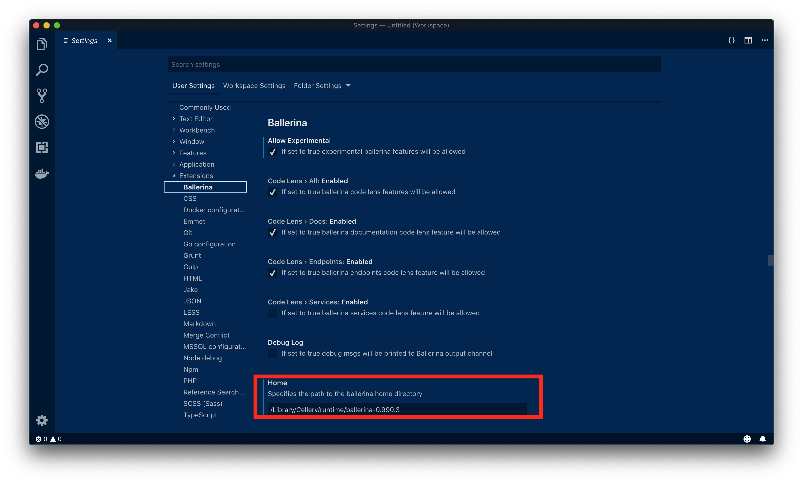
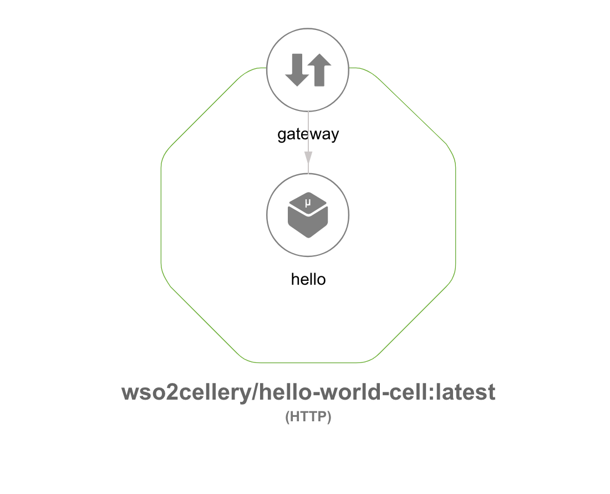

[](https://travis-ci.org/wso2-cellery/sdk)
[](https://codecov.io/gh/wso2-cellery/sdk)
[](https://github.com/wso2-cellery/sdk/releases)
[](https://github.com/wso2-cellery/sdk/releases)
[](https://github.com/wso2-cellery/sdk/commits/master)
[](https://opensource.org/licenses/Apache-2.0)

Cellery is a code-first approach to building, integrating, running and managing composite microservice applications on Kubernetes. 
Build, push/pull, run, scale and observe composites. Create secure APIs by default, code components in any language.

----

## Getting Started
### Pre requisites 
1. kubectl v1.11.x (Execute `kubectl version` command and make sure kubectl client is v1.11. Please follow [instructions](https://kubernetes.io/docs/tasks/tools/install-kubectl/) to install kubectl v1.11.x)
2. [Existing Kubernetes cluster](https://kubernetes.io/docs/setup/) OR  
   [VirtualBox](https://www.virtualbox.org/wiki/Downloads) (for a local installation including a Kubernetes cluster) OR  
   [Google Cloud SDK](https://cloud.google.com/sdk/) (to install cellery runtime in GCP)

### Setup Cellery CLI

#### Linux
Download the [cellery-ubuntu-x64-0.2.0.deb](https://wso2-cellery.github.io/downloads) and install it using dpkg command as shown below.
```
dpkg -i cellery-ubuntu-x64-0.2.0.deb
```
#### Mac OS
Download [cellery-0.2.0.pkg](https://wso2-cellery.github.io/downloads) and install it by following macOS package installation steps.

### Setup Cellery runtime
Once Cellery is installed, verify the installation is working by executing `cellery version` command.

You can install the cellery runtime locally as a virtual machine (`Local`), in Google Cloud Platform (`GCP`)
or in any Kubernetes cluster (`Existing cluster`). The installation options can be selected interactively or by passing inline command options.
More can go to [cellery setup](docs/cli-setup-command.md) for more details.

#### Which option to choose to install cellery runtime?

* if you want to deploy in google cloud and have a Google cloud account -> select `GCP` option
* if you want to deploy in an existing K8s cluster -> select`Existing cluster` option
* if you want to deploy locally via a pre-built VM -> select `Local` option 

#### Cellery runtime packages
Cellery can be installed in two packages; Basic or Complete. The following is a comparison between two options:

| Packages | Components | Supported Functionality | 
|----------|------------|-------------------------|
| Basic | <ul><li>Cell controller</li><li>Light weight Identity Provider</li></ul>| <ul><li>HTTP(S) cells with local APIs</li><li>Full support for web cells</li><li>Inbuilt security for inter cell and intra cell communication</li></ul> |
| Complete | <ul><li>Cell controller</li><li>Global API manager</li><li>Observability portal and components</li></ul> | <ul><li>Full HTTP(S) cells with local/global APIs</li><li>Full support for web cells</li><li>Inbuilt security for inter cell and intra cell communication</li><li>API management functionality</li><li>observability of cells with rich UIs</li></ul> |

Please follow the relevant link below for the chosen setup.

#### [1. Local setup](docs/setup/local-setup.md)
#### [2. Existing Cluster](docs/setup/existing-cluster.md)
#### [3. GCP setup](docs/setup/gcp-setup.md)     

### Setup Cellery Tooling(Optional)
<details>
<summary>Click here to view the steps</summary>

1. Download and install [VS Code](https://code.visualstudio.com/Download).
1. Install the [Ballerina vscode plugin 0.990.3](https://product-dist.ballerina.io/downloads/0.990.3/ballerina-vscode-plugin-0.990.3.vsix). 
1. Open VS Code and navigate to `File|Code->preferences->settings->Extensions->Ballerina` and set the home value to following. 

##### Linux
```bash
/usr/share/cellery/runtime/ballerina-0.990.3
```

##### Mac OS
```bash
/Library/Cellery/runtime/ballerina-0.990.3
```
                               

</details>

### Quick start with cellery
Let's quickly run a sample hello world cell as shown in the diagram below.  

 

The `hello-world-cell` contains, one component `hello` and it's a web app. The `hello` component is exposed globally via a global and cell gateway.
In the quick start we'll be deploying this `hello-world-cell` and browsing the `hello` component's web page.  

---
Please follow below instructions to run the hello-world-cell.

1) Execute below command that will download the hello world web cell from `wso2cellery` organization in [docker hub](https://hub.docker.com/u/wso2cellery) and run the cell.
    ```
    $ cellery run wso2cellery/hello-world-cell:0.2.0 -n hello-world-cell
    ✔ Connecting to registry-1.docker.io
    ✔ Fetching metadata
    ✔ Pulling image wso2cellery/hello-world-cell:0.2.0
    ✔ Saving new Image to the Local Repository
    
    Image Digest : sha256:2d5659e5787df7e7ae0f58671c0b9d857b5a19e5fbdb02fccbc98a64016a97f6
    
    ✔ Extracting Cell Image wso2cellery/hello-world-cell:0.2.0
    
    Main Instance: hello
    
    ✔ Reading Cell Image wso2cellery/hello-world-cell:0.2.0
    ✔ Validating dependencies
    
    Instances to be Used:
    
      INSTANCE NAME                            CELL IMAGE             USED INSTANCE   SHARED
     ------------------------- ------------------------------------- --------------- --------
      hello-world-cell           wso2cellery/hello-world-cell:0.2.0   To be Created    -
    
    Dependency Tree to be Used:
    
     No Dependencies
    
    ? Do you wish to continue with starting above Cell instances (Y/n)?
    
    ✔ Starting main instance hello-world-cell
    
    
    ✔ Successfully deployed cell image: wso2cellery/hello-world-cell:0.1.0
    
    What's next?
    --------------------------------------------------------
    Execute the following command to list running cells:
      $ cellery list instances
    --------------------------------------------------------
    ```
2) Optionally you can run `kubectl` or `cellery` commands to check whether all pods are up and running. 
    ```
    $ kubectl get pods
    NAME                                         READY     STATUS        RESTARTS   AGE
    hello--gateway-deployment-65fd8668cb-k7dqp   1/1       Running       0          2m
    hello--hello-deployment-6df6fcbd8c-2s65r     2/2       Running       0          2m
    hello--sts-deployment-6dc7958bbb-sg992       2/2       Running       0          2m
    ```
    OR
    
    ```
    $ cellery list instances
                      INSTANCE                                   CELL IMAGE                   STATUS                            GATEWAY                            COMPONENTS            AGE
     ------------------------------------------ -------------------------------------------- -------- ----------------------------------------------------------- ------------ -----------------------
      hello                                      wso2cellery/hello-world-cell:0.1.0   Ready    hello--gateway-service                                      1            30 minutes 48 seconds
    ```

3) You would have added an entry into your `/etc/hosts` file during the setting up your runtime [local setup](docs/setup/local-setup.md#configure-host-entries), [Existing Cluster](docs/setup/existing-cluster.md#configure-host-entries), 
and [GCP setup](docs/setup/gcp-setup.md)     , 
so that your browser will use the right IP address for `hello-world.com`. Use the `kubectl` tool to make sure the IP your service is running on:
    ```
    $ kubectl get ingress
    NAME                     HOSTS             ADDRESS        PORTS   AGE
    hello--gateway-ingress   hello-world.com   192.168.56.10   80      3m
    ```
    Check it's correctly configured in `/etc/hosts` to resolve `hello-world.com` to one of those IPs. 
    ```
    192.168.56.10  hello-world.com
    ```

4) Now browse [http://hello-world.com/](http://hello-world.com/) and you will should see the cell web page running.

Congratulations! You have successfully got running the first web cell running!  


### Build and deploy your first cell 
In this section let's focus on initialize, build, run and push the same hello world cell explained above. Follow the instructions listed below to create your first cell.

1. Execute cellery init command from the command prompt, and provide the project name as ‘hello-world-cell’. 
    ```
    $ cellery init
    ? Project name:  [my-project] hello-world-cell
    
    
    ✔ Initialized project in directory: /Users/cellery/hello-world-cell
    
    What's next?
    --------------------------------------------------------
    Execute the following command to build the image:
      $ cellery build helloworld/helloworld.bal [repo/]organization/image_name:version
    --------------------------------------------------------
    ```
2. The above step will auto generate a cellery file in the location: hello-world-cell/hello-world-cell.bal with below content. This file is implemented in [Ballerina](https://ballerina.io/) - A Cloud Native Programming Language. 
The cell `helloCell` consists of one component defined as `helloComponent` and it has one web ingress with default vhost `hello-world.com`.
An environment variable `HELLO_NAME`with default value `Cellery` is used by `helloComponent` to render the webpage. By passing the  parameters in the runtime, the vhost entry and
env variable HELLO_NAME can be modified.

    ```ballerina
    import ballerina/config;
    import celleryio/cellery;
    
    // Hello Component
    // This Components exposes the HTML hello world page
    cellery:Component helloComponent = {
        name: "hello",
        source: {
            image: "wso2cellery/samples-hello-world-webapp"
        },
        ingresses: {
            webUI: <cellery:WebIngress> { // Web ingress will be always exposed globally.
                port: 80,
                gatewayConfig: {
                    vhost: "hello-world.com",
                    context: "/"
                }
            }
        },
        envVars: {
            HELLO_NAME: {value: "Cellery"}
        }
    };
    
    // Cell Initialization
    cellery:CellImage helloCell = {
        components: {
            helloComp: helloComponent
        }
    };
    
    # The Cellery Lifecycle Build method which is invoked for building the Cell Image.
    #
    # + iName - The Image name
    # + return - The created Cell Image
    public function build(cellery:ImageName iName) returns error? {
        return cellery:createImage(helloCell, iName);
    }
    
    # The Cellery Lifecycle Run method which is invoked for creating a Cell Instance.
    #
    # + iName - The Image name
    # + instances - The map dependency instances of the Cell instance to be created
    # + return - The Cell instance
    public function run(cellery:ImageName iName, map<cellery:ImageName> instances) returns error? {
        string vhostName = config:getAsString("VHOST_NAME");
        if (vhostName !== ""){
            cellery:WebIngress web = <cellery:WebIngress> helloComponent.ingresses.webUI;
            web.gatewayConfig.vhost = vhostName;
        }
    
        string helloName = config:getAsString("HELLO_NAME");
        if (helloName !== ""){
            helloComponent.envVars.HELLO_NAME.value = helloName;
        }
        return cellery:createInstance(helloCell, iName);
    }
    ```

3. Build the cellery image for hello world project by executing the cellery build command as shown below. Note `DOCKER_HUB_ORG` is your organization name in docker hub.
    ```
    $ cd hellow-world-cell
    $ cellery build hello-world-cell.bal <DOCKER_HUB_ORG>/hello-world-cell:1.0.0
    Hello World Cell Built successfully.
    
    ✔ Building image <DOCKER_HUB_ORG>/hello-world-cell:1.0.0
    ✔ Saving new Image to the Local Repository
    
    
    ✔ Successfully built cell image: <DOCKER_HUB_ORG>/hello-world-cell:1.0.0
    
    What's next?
    --------------------------------------------------------
    Execute the following command to run the image:
      $ cellery run <DOCKER_HUB_ORG>/helloworld:1.0.0
    --------------------------------------------------------
    ```

4. Note that in the cell file's run method at step-2, it's looking for runtime parameters `VHOST_NAME` and `HELLO_NAME`, 
and if it's available then it'll will be using those as vhost and greeting name. Therefore run the built cellery image with ‘cellery run’ command, 
and pass `my-hello-world.com` for `VHOST_NAME`, and your name for `HELLO_NAME` as shown below. 
    ```
    $ cellery run <DOCKER_HUB_ORG>/hello-world-cell:1.0.0 -e VHOST_NAME=my-hello-world.com -e HELLO_NAME=WSO2 -n my-hello-world
       ✔ Extracting Cell Image  <DOCKER_HUB_ORG/hello-world-cell:1.0.0
       
       Main Instance: my-hello-world
       
       ✔ Reading Cell Image  <DOCKER_HUB_ORG/hello-world-cell:1.0.0
       ✔ Validating environment variables
       ✔ Validating dependencies
       
       Instances to be Used:
       
         INSTANCE NAME              CELL IMAGE                      USED INSTANCE   SHARED
        ---------------- ----------------------------------------- --------------- --------
         my-hello-world    <DOCKER_HUB_ORG>/hello-world-cell:1.0.0   To be Created    -
       
       Dependency Tree to be Used:
       
        No Dependencies
       
       ? Do you wish to continue with starting above Cell instances (Y/n)?
       
       ✔ Starting main instance my-hello-world
       
       
       ✔ Successfully deployed cell image:  <DOCKER_HUB_ORG>/hello-world-cell:1.0.0
       
       What's next?
       --------------------------------------------------------
       Execute the following command to list running cells:
         $ cellery list instances
       --------------------------------------------------------
    ```
    
5. Now your hello world cell is deployed, you can run the cellery list instances command to see the status of the deployed cell.
    ```
    $ cellery list instances
                        INSTANCE                                   CELL IMAGE                   STATUS                            GATEWAY                            COMPONENTS           AGE
       ------------------------------------------ -------------------------------------------- -------- ----------------------------------------------------------- ------------ ----------------------
        hello-world-cell-1-0-0-676b2131   sinthuja/hello-world-cell:1.0.0              Ready    sinthuja-hello-world-cell-1-0-0-676b2131--gateway-service   1            10 minutes 1 seconds
    ```
6. Execute `cellery view` to see the components of your cell. This will open a HTML page in a browser and you can visualize the components and dependent cells of the cell image.
    ```
    $ cellery view <DOCKER_HUB_ORG>/hello-world-cell:1.0.0
    ```
    
    
7. Access url [http://my-hello-world.com/](http://my-hello-world.com/) from browser. You will see updated web page with greeting param you passed for HELLO_NAME in step-4.

8. As a final step, let's push your first cell project to your docker hub account. Tp perform this execute `cellery push` as shown below.
    ```
    $ cellery push <DOCKER_HUB_ORG>/hello-world-cell:1.0.0
    ✔ Connecting to registry-1.docker.io
    ✔ Reading image <DOCKER_HUB_ORG>/hello-world-cell:1.0.0 from the Local Repository
    ✔ Checking if the image <DOCKER_HUB_ORG>/hello-world-cell:1.0.0 already exists in the Registry
    ✔ Pushing image <DOCKER_HUB_ORG>/hello-world-cell:1.0.0
    
    Image Digest : sha256:8935b3495a6c1cbc466ac28f4120c3836894e8ea1563fb5da7ecbd17e4b80df5
    
    ✔ Successfully pushed cell image: <DOCKER_HUB_ORG>/hello-world-cell:1.0.0
    
    What's next?
    --------------------------------------------------------
    Execute the following command to pull the image:
      $ cellery pull <DOCKER_HUB_ORG>/hello-world-cell:1.0.0
    --------------------------------------------------------
    ```
 Congratulations! You have successfully created your own cell, and completed getting started!
 
### Clean up
You can terminate the cells that are started during this guide.

1) List the cells that are running in the current setup by `cellery list instances`.
    ```
    $ cellery list instances
         INSTANCE                      CELL IMAGE                   STATUS               GATEWAY               COMPONENTS            AGE
     ---------------- -------------------------------------------- -------- --------------------------------- ------------ -----------------------
      hello            wso2cellery/hello-world-cell:0.1.0    Ready    hello--gateway-service            1            1 hours 2 minutes
      my-hello-world   <ORGNAME>/hello-world-cell:1.0.0              Ready    my-hello-world--gateway-service   1            27 minutes 42 seconds
    ```
2) Execute terminate command for each cell instances that you want to clean up as shown below.
    ```
    $ cellery terminate hello
    $ cellery terminate my-hello-world
    ```

## What is next?
- [Try Petstore application](https://github.com/wso2-cellery/samples/tree/master/pet-store) 

## Useful links
- [Samples](https://github.com/wso2-cellery/samples)
- [How to code cells?](docs/cell-reference.md)
- [CLI commands](docs/cli-reference.md)
- [Architecture](docs/cellery-architecture.md)

## Community 
- [Cellery mailing list](https://groups.google.com/forum/#!forum/wso2-cellery-dev)
- [How to contribute?](CONTRIBUTING.md)
