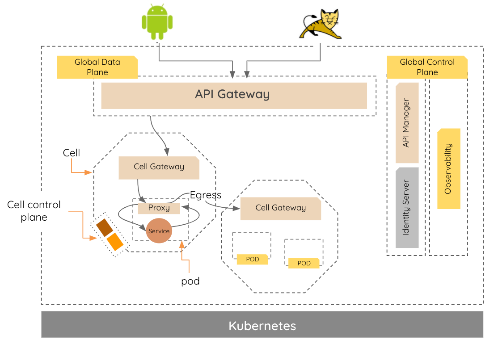

## High Level Architecture of Cellery Mesh

### Cell
A cell is an immutable application component that can be built, deployed and managed as a complete unit. 
The cell consists of multiple services, managed APIs, ingress and egress policies (including routing, throttling, 
access control), security trust domain, deployment policies, rolling update policies and external dependencies. 
The cell definition captures all of these in a standard technology-neutral fashion. The detailed specification of the 
cell definition can be found [here](https://github.com/wso2/reference-architecture/blob/master/reference-architecture-cell-based.md).

### Data Plane 
Data plane includes the pods, sidecars, services, etc that participate in dispatching the requests to cells, and the 
components within the cell. This includes global gateway, cell gateway, and cell egress.

#### Global Data Plane (Gateway)
APIs to be exposed to the external world from Cellery Mesh will be published to the global gateway. When a Cell 
descriptor is being written, it should mention which APIs to expose on the Cell Gateway and which should be exposed on 
the Global data plane. 

#### Cell Gateway (Cell Ingress)
Ingress into the cell will be via the cell gateway only. The cell APIs are deployed on the cell gateway. When defining 
a cell, the cell APIs to be published to the cell gateway can be defined.

#### Cell Egress
Inter-cell & intra-cell calls will go through the side car deployed along with each micro services within the cell which is 
the Envoy proxy.

### Cell Control Plane
The cell control plane, controls the intra-cell communications. This consists of Cell STS services 
as mentioned below.

#### Cell Secure Token Service 
As each cell is considered as a separate trust domain, each cell has a secure token service which is used to exchange 
tokens in order to securely communicate by workloads. Each STS has its own configurations which decides the behaviour of 
token issuance and validations. Furthermore, each cell STS has an Open Policy Agent instance which is used to enforce 
fine grained access control. Cell deployers can enforce authorization policies for inter cell communication as 
well as intra cell communications. The detailed information about the security of Cellery can be found in 
[mesh-security](https://github.com/wso2-cellery/mesh-security)..

### Global Control Plane
Global control plane controls the request flow from external systems, and also provide overall control of cells globally, 
and inter-cell communication. API Manager, Observability, and Security are the core components of the global control 
plane as explained below. 
 
#### API Manager
The Global Control Plane will have API Management capabilities in the form of API Publishing (mostly via APIs), and API 
Discovery (Store). Cell definition includes description of an API (endpoint) and specify whether the API needs to be 
deployed in the global gateway or cell gateway or both. Based on the cell definition, the API will be published to 
Global API Manager. 

#### API Discovery
External API consumers and Internal API consumers (cell, internal app developers) will use the API Store in the Global 
Control Plane to discover available APIs and their documentation. 

#### Observability
Cellery observability is enabled by default. Observability Global Control plane will consist WSO2 Stream processor as 
the core observability engine. The envoy proxies, and API gateways, will push the metrics and traces related information 
to the Observability control plane, to process, analyze and visualize the data. Also this layer can be used to provide 
the runtime governance of the system. 

#### Security
APIs exposed through global gateway can be secured with OAuth and other state of the art authentication mechanisms. 
Not only authentication, but all functionalities and extension points provided through API manager can be used to 
authenticate and authorize API requests. 

Within Cellery, each cell is considered as a unique trust domain and each of these cells have its own Secure Token 
Service (STS) which the workloads use to communicate in a trusted manner with each other. Not only authentication, but 
also fine grained authorization requirements are also  can be achieved for inter and intra cell communications. Cellery 
uses Open Policy Agent to enforce fine grained access control within cell and inter cells. 

All these operations and checks are enforced through sidecars which are running along side workloads. Considering 
security aspects of a service and passing user context or information will be out of component developers tasks and 
will be managed by Cellery within the mesh.  Refer [mesh-security](https://github.com/wso2-cellery/mesh-security). for more information on Cellery Security and how to 
enforce policies. The detailed information about the security of Cellery can be found [mesh-security](https://github.com/wso2-cellery/mesh-security).
